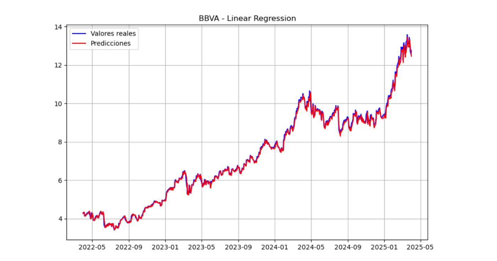

# 📊 Entrenamiento, predicciones y pruebas (TFM IBEX 35)

Este módulo agrupa el conjunto de scripts y notebooks dedicados a entrenar modelos de *machine learning* por empresa del IBEX 35, generar predicciones para distintos horizontes temporales y realizar pruebas sobre la precisión y comportamiento de los modelos.

---

## 🎯 Objetivo general

Automatizar el entrenamiento, almacenamiento y evaluación de modelos predictivos por empresa y por horizonte temporal (`lag = 1`, `lag = 7`, `lag = 15`), así como facilitar su integración posterior con un agente conversacional o sistema interactivo.

---

## 📁 Archivos incluidos

### `entrenar_modelos_por_empresa.py`

Este script:

- Recorre todas las empresas presentes en el dataset.
- Para cada empresa:
  - Carga los datos y genera variables *lag* y temporales.
  - Divide los datos en entrenamiento y test.
  - Ajusta el modelo más adecuado según el horizonte (`LinearRegression` para `lag=1` y `SVR` para `lag=7` y `lag=15`).
  - Guarda el modelo como archivo `.pkl` con el nombre:
    ```
    <EMPRESA>_lag<k>.pkl
    ```

> 🗂️ Salida: modelos entrenados listos para usar en la carpeta `/modelos/`.

---

### `predicciones_por_empresa.py`

Este script permite generar predicciones automáticas por empresa y horizonte:

- Carga el modelo `.pkl` correspondiente.
- Repite el preprocesamiento de datos.
- Realiza la predicción sobre el conjunto de test.
- Devuelve:
  - Predicciones (`y_pred`)
  - Valores reales (`y_test`)
  - RMSE
  - Última predicción generada

> 🔌 Útil para conectarlo a una interfaz de usuario o chatbot.

---

### `pruebas.ipynb`

Este notebook permite realizar:

- Verificación manual del rendimiento de modelos por empresa.
- Visualización de gráficos reales vs predicción.
- Cálculo de métricas de error (RMSE) para analizar la precisión.
- Pruebas con cambios en el preprocesamiento o el modelo.

> 🧪 Ideal para exploración, debugging o comparación visual.

---

### 📈 Ejemplo de predicción real

Gráfico generado en `pruebas.ipynb` para el modelo de **Linear Regression** aplicado a **BBVA** (`lag = 1`):



> La línea azul representa los valores reales y la línea roja las predicciones generadas por el modelo.

---

## 🛠️ Requisitos

- Python 3.8+
- Bibliotecas necesarias:
  - `pandas`, `numpy`, `scikit-learn`, `matplotlib`, `pickle`
- Ruta válida al módulo `src/lag1_funciones/` con los siguientes archivos:
  - `preprocessing.py`, `features.py`, `model_training.py`, `scaling.py`, `visualization.py`

---
